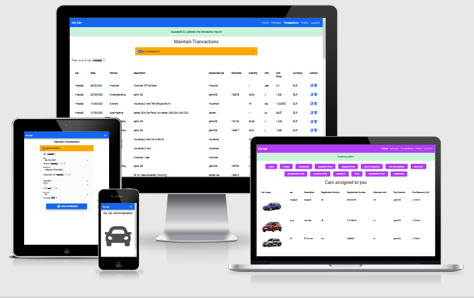

# [My Car Administration](https://my-car-ruszkipista.herokuapp.com/)
A Flask and MongoDB-Atlas based CRUD application, styled with Material Design Bootstrap. Inspired by the "Task Manager" code along mini project in the Code Institute curriculum and my [MyCar](https://github.com/ruszkipista/MyCar) android app written for an assignment earlier. This project is my third milestone in obtaining the [Full Stack Web Development](https://codeinstitute.net/full-stack-software-development-diploma/) diploma from [Code Institute](https://codeinstitute.net/)



## Contents
- [1. UX design](#1-ux-design "1. UX design")
  - [1.1 Strategy Plane](#11-strategy-plane "1.1 Strategy Plane")
  - [1.2 Scope plane](#12-scope-plane "1.2 Scope plane")
  - [1.3 User Stories](#13-user-stories "1.3 User Stories")
  - [1.4 Structure plane](#14-structure-plane "1.4 Structure plane")
  - [1.5 Skeleton plane](#15-skeleton-plane "1.5 Skeleton plane")
  - [1.6 Surface plane](#16-surface-plane "1.6 Surface plane")
- [2. Program design](#2-program-design "2. Program design")
- [3. Features Left to Implement](#3-features-left-to-implement "3. Features Left to Implement")
- [4. Technologies and Tools Used](#4-technologies-and-tools-used "4. Technologies and Tools Used")
- [5. Issues solved during development](#5-issues-solved-during-development "5. Issues solved during development")
- [6. Testing](#6-testing "6. Testing")
- [7. Deployment](#7-deployment "7. Deployment")
- [8. Credits](#8-credits "8 Credits")

## 1. UX design
### 1.1 Strategy Plane
Stakeholders of the website:
- xxx

#### 1.1.1 Goals and Objectives of Stakeholders (users)
|G#|User|Goals, Needs, Objectives|
|--|----|------------------------|
|G1|xxx|yyy|


### 1.2 Scope plane
It has been decided to create a...

The following table lists the planned features, each feature referenced with original goal(s):

|F#|Goal|Feature|
|--|----|-------|
|F1|G1|...|

### 1.3 User Stories
* As a ... I want to ..., so I can ...

### 1.4 Structure plane
The structure of the website to be built consist of a ... 

<p style="text-align: center;"><p>

### 1.5 Skeleton plane

<details>
  <summary>Features and Wireframe of ... page</summary>

<h3>... page with Navbar and responsive Body of text and images and Input fields</h3>

|Section|Feature / Content description|
|--------------|-----------------------------|
|Navbar|...|
|Header|...|

<br>

</details>


### 1.6 Surface plane
Chose font [Roboto](https://fonts.google.com/specimen/Roboto) for the headers.

The images, tiles and icons 

## 2. Program design


## 3. Features Left to Implement
* ...

## 4. Technologies and Tools Used

- The project's product (the website) was written in HTML, CSS and JavaScript, utilising [Bootstrap 5.0 Beta](https://getbootstrap.com/docs/5.0/) framework (which itself uses CSS and JavaScript). Bootstrap is used for its responsive utilities. 
- Manipulated images with program [Paint.NET](https://www.getpaint.net/). Mainly used for cropping, resizing, background removal and format conversion.
- downloaded [youtube](https://www.youtube.com/) videos with [youtube-dl](https://youtube-dl.org/)
- extracted and cut sound clips with [Audacity](https://www.audacityteam.org/)
- Created wireframes with program from [balsamiq](https://balsamiq.com/wireframes/)
- Written study notes on [Google Docs](https://docs.google.com/)
- Disassembled a PDF file with [Adobe Acrobat PRO](https://acrobat.adobe.com/ie/en/acrobat.html)
- Edited the code with [Visual Studio Code](https://code.visualstudio.com/), the page preview was provided via [Live Server](https://github.com/ritwickdey/vscode-live-server) VS Code extension.
- Managed code versions with [Git](https://git-scm.com/downloads)
- Stored the code and project deliverables cloud service [Github](https://github.com/) repository with versions.
- Deployed the website on [GitHub Pages](https://pages.github.com/)
- The development machine run [Windows 10](https://www.microsoft.com/en-us/software-download/windows10) operating system.
- The website was tested on desktop on [Chrome](https://www.google.com/intl/en_ie/chrome/) and [Firefox](https://www.mozilla.org/en-US/firefox/) web browsers, also on a [Asus Google Nexus 7 (2013)](https://www.gsmarena.com/asus_google_nexus_7_(2013)-5600.php) tablet running [Android OS](https://www.android.com/) and mobile [Chrome](https://play.google.com/store/apps/details?id=com.android.chrome&hl=en) browser.
- Generated favicon with [Favicon & App Icon Generator](https://www.favicon-generator.org/)
- Generated one image (on top of this Readme) of how the website looks on different size devices with [Am I Responsive](http://ami.responsivedesign.is/)
- Chose font using [Google Fonts](https://fonts.google.com/)
- Run CSS code through [Autoprefixer CSS online](https://autoprefixer.github.io/) to supplement suggested vendor prefixes
- Searched the internet to find content, documentation and solution for issues using [Google](https://www.google.com)'s search service.
- connected to the internet using [Vodafone](https://n.vodafone.ie/shop/broadband.html)'s broadband service.

## 5. Issues solved during development
...

## 6. Testing

First step in testing was the validation of HTML, CSS and JS code with [Markup Validation Service](https://validator.w3.org/), [CSS Validation Service](https://jigsaw.w3.org/css-validator/), [JS Hint](https://jshint.com/) respectively. 
The whole testing was conducted manually on Windows 10 desktop device running Chrome browser on a 1920x1080 resolution screen and on an Android tablet. Not tested on mobile phone, because the limited sceen estate does not allow game play in a way as intended.

See the whole <a href="https://ruszkipista.github.io/cims03-my-car/assets/doc/ci-ms3-test-log.html" target="_blank">test log</a> in a webpage.

No additional bugs were discovered during the final testing.

Conclusion: The website performs on desktop and tablet as intended.

## 7. Deployment
 
### Deployment in development environment

#### 7.0 Python and Git
Make sure, that [Python](https://www.python.org/downloads/) and [Git](https://git-scm.com/downloads) are installed on your computer

### 7.1 Set up the MongoDB-Atlas hosted database

* Sign up for a free account on [MongoDB](https://www.mongodb.com/)
* create a new organisation and a new project
* inside the project at Database Deployments, create a new cluster
  * choose Shared / free tier cloud privider and region / M0 tier / choose cluster name
* inside the newly created cluster create a database, e.g. `my_car`
* in Deployment Security / Database Access, create a user with password authentication, select role `readWriteAnyDatabase`

Note down the following details:
- cluster name
- database name
- database user and password

#### 7.2 Clone the project's GitHub repository

1. Locate the repository here https://github.com/ruszkipista/cims03-my-car
2. Click the 'Code' dropdown above the file list
3. Copy the URL for the repository (https://github.com/ruszkipista/cims03-my-car.git)
4. Open a terminal on your computer
5. Change the current working directory where the cloned folder will be located
6. Clone the repo onto your machine with the following terminal command
'''
git clone https://github.com/ruszkipista/cims03-my-car.git
'''

#### 7.3 Create local files for environment variables
Change working directory to the cloned folder and start your code editor
```
cd cims03-my-car
code .
```
Create file `envWS.py` with the following content into the root of the project folder
```
import os
os.environ.setdefault("FLASK_SECRET_KEY", "<secret key>")
os.environ.setdefault("FLASK_IP",         "127.0.0.1")
os.environ.setdefault("PORT",             "5500")
os.environ.setdefault("FLASK_DEBUG",      "True")
```
The `<secret key>` can be any random charater string from your keyboard.

Create file `envDB.py` into the root of the project folder with the following content:
```
import os
os.environ.setdefault("MONGO_CLUSTER",    "<cluster name>")
os.environ.setdefault("MONGO_DB_NAME",    "database namer")
os.environ.setdefault("MONGO_DB_USER",    "<user name>")
os.environ.setdefault("MONGO_DB_PASS",    "<password>")
os.environ.setdefault("MONGO_INIT",       "True")
```
Take `<cluster name>`, `<username>`, `<password>` from the MongoDB creation item at 7.1

The `MONGO_INIT=True` parameter triggers the initialization of the database content, every time the application is started. To prevent that, set it to `False` so your changes in the DB are preserved between sessions. If you make a change in the DB structure, the DB content needs to be initialized or you need to do the fieldcatalog and collection changes manually on the DB.
  
#### 7.4 Set up the Python environment
In your development environment, upgrade `pip` if needed
```
pip install --upgrade pip
```
Install `virtualenv`:
```
pip install virtualenv
```
Open a terminal in the project root directory and run:
```
virtualenv venv
.\venv\Scripts\activate
pip install -r requirements.txt
```
#### 7.5 Start the web server:
```
python app.py
```

### Deployment on Heroku
[Heroku](https://www.heroku.com/) is a PaS cloud service, you can deploy this project on it for free.

#### 7.6 Prequisites:
- you forked or copied this project into your repository on GitHub.
- Heroku requires theese files to deploy successfully, they are both in the root folder of the project:
- `requirements.txt`
- `Procfile`
- you already have a Heroku account, or you need to register one.

#### 7.7 Create a Heroku App
Follow these steps to deploy the app from GitHub to Heroku:
- In Heroku, Create New App, give it a platform-unique name, choose region, click on `Create App` button
- On the app/Deployment page select GitHub as Deployment method, underneath click on `Connect GitHub` button
- In the GitHub authorization popup window login into GitHub with yout GitHub usename and click on `Authorize Heroku` button
- Type in repo name and click 'search'. It lists your repos, choose the one and then click on 'connect' next to it.
- either enable automatic deployment on every push to the chosen branch or stick to manual deployment
- go to app/Settings page, click on `Reveal Config Vars` and enter the following variables and their values from the `envWS.py` and `envDB` files:
  * FLASK_SECRET_KEY
  * MONGO_CLUSTER
  * MONGO_DB_NAME
  * MONGO_DB_PASS
  * MONGO_DB_USER
  * MONGO_INIT

The `MONGO_INIT=True` parameter triggers the initialization of the database content, be mindful when you allow this to happen.
Furthermore, if you youse the same MongoDB database as in development, the init can ruin your data on Heroku an vica versa.

## 8. Credits

### Acknowledgements
My inspiration for this project came from ...

I thank [Nishant Kumar](https://github.com/nishant8BITS) for mentoring me during the project. He suggested to study [Clean Code](http://cleancoder.com/) by Uncle Bob and split up the monolith code into small functions. Despite much of my efforts, Uncle Bob still would not approve the current state of the code, there is still much to learn ...

### Media
Used 4 car images from google search, edited and resized them

