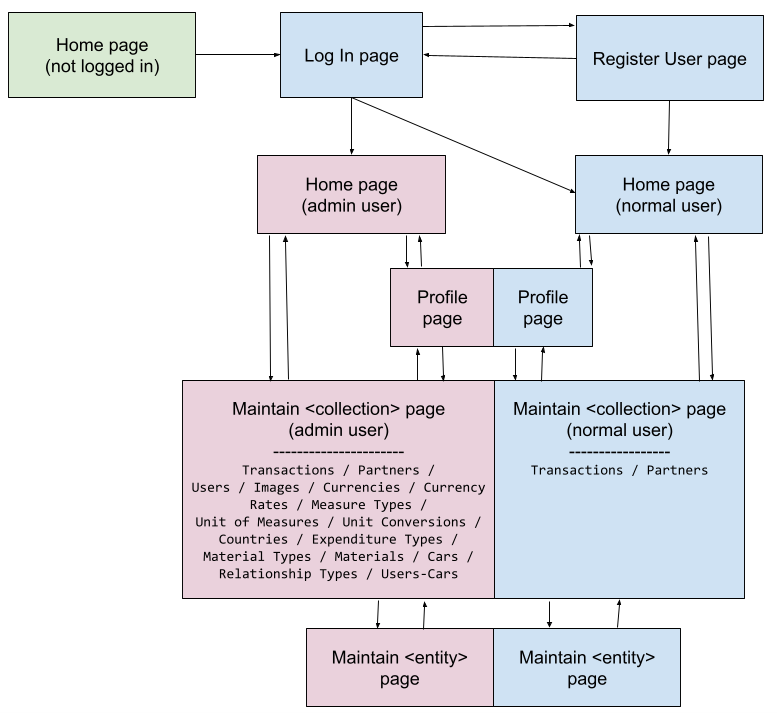
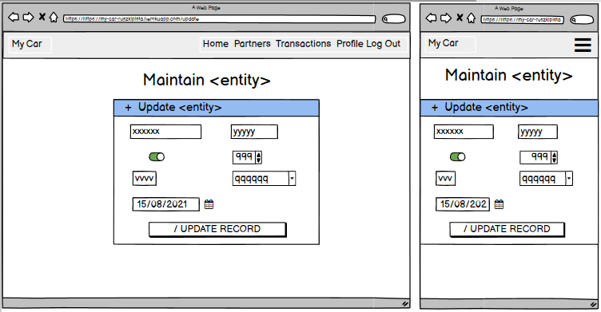

# [My Car Administration](https://my-car-ruszkipista.herokuapp.com/)
Track the cost and fuel consumption of the fleet of cars in the family! While recording transactions is straightforward for all family members, there are administrative aspects of the database, which need steady hands. Hence I wrote this CRUD web application to maintain the My Car app's database. (The My Car app itself is a separate development endeavour though). Inspired by my own car cost tracking spreadsheet and the "Task Manager" code along mini project in the Code Institute curriculum.

The Project's aim is to demonstrate backend focused development skills coupled with CRUD operations on Non-SQL database. Written in Python using Flask and MongoDB-Atlas, styled with Material Design Bootstrap. This project is my third milestone in obtaining the [Full Stack Web Development](https://codeinstitute.net/full-stack-software-development-diploma/) diploma from [Code Institute](https://codeinstitute.net/)


A live demo can be found - [here](https://my-car-ruszkipista.herokuapp.com/)

The Project Repository can be found - [here](https://github.com/ruszkipista/cims03-my-car)

## Contents
- [0. Data design](#0-data-design "0. Data design")
- [1. UX design](#1-ux-design "1. UX design")
  - [1.1 Strategy Plane](#11-strategy-plane "1.1 Strategy Plane")
  - [1.2 Scope plane](#12-scope-plane "1.2 Scope plane")
  - [1.3 User Stories](#13-user-stories "1.3 User Stories")
  - [1.4 Structure plane](#14-structure-plane "1.4 Structure plane")
  - [1.5 Skeleton plane](#15-skeleton-plane "1.5 Skeleton plane")
  - [1.6 Surface plane](#16-surface-plane "1.6 Surface plane")
- [2. Program design](#2-program-design "2. Program design")
- [3. Features Left to Implement](#3-features-left-to-implement "3. Features Left to Implement")
- [4. Technologies and Tools Used](#4-technologies-and-tools-used "4. Technologies and Tools Used")
- [5. Issues](#5-issues "5. Solved and Known issues")
- [6. Testing](#6-testing "6. Testing")
- [7. Deployment](#7-deployment "7. Deployment")
- [8. Credits](#8-credits "8 Credits")

## 0. Data design
Let's introduce briefly the data structures of the My Car application. It is necessary to learn some features to understand the reason behind arrangements in the data.

The main entity is the Car. We want collect financial transactions occurring around cars in order to answer such questions
- what is the fuel economy looks like, how much fuel it consumes on a set distance or how much distance it can take on a set amout of fuel?
- how much do we spend on the car to run daily, monthly, yearly?
- how much does it cost to run 100 km?
- how much is the book value of the car today?

### 0.1 Transaction
So in order to calculate all of that, we need to record the following things about a Transaction:
- which car it relates to,
- when did it happen
- who was the business partner on the other end of the transaction
- description to record details which does not conform to any other transaction details
- what material/service was involved - to be able to separate operating and capital expenses
- how much quantity and what unit  - for various reasons
- what was the price in what currency? - for expense calculation
- to keep track the run distances between refuellins, we need the status of the odometer when it happened

### 0.2 Car
In the Car entity we need a couple of identifiers:
- a picture for visuals
- a name and description
- a plate number for official records
- in what country was the car registered in - this can pull in the default currency into the transaction
For keeping track of the distance run and calculate fuel consumption:
- unit of the odometer, is it km or miles?
- what fuel material do we need: petrol or gasoline? or perhaps electricity? - this can pull in the unit of measure in the transaction
- what unit do we want to see the fuel consumption in: L/100km or miles/gallon?

### 0.3 Country
To be able to record registration country, we need the Country entity, in which we store
- country's standard sign. e.g. IE, HU
- description
- official currency for payment - this can go into the transaction as default value
- official distance keeping unit on roads, e.g. km for IE, miles for NI
- in what unit the liquid fuel sold, liter or gallon?

### 0.4 Currency
To be able to record fiscal values in different countries, we need to set up Currencies:
- 3 characters ISO designation,
- description
- 1 or 2 character short sign in local abbreviation or characters

### 0.5 Currency Conversions
If we take the car out of the registration country, we might need to pay in a different currency. To be able to aggregate fiscal values in the registration country's currency, we need to convert currency values, hence the Currency Conversions collection which consist of
- validity date of the conversion rate
- source currency
- target currency
- exchange rate: unit source currency value expressed in target currency value, e.g. 1 EUR => 0.89080 GBP on 01/01/2018
For simplicity, we allow the conversion calculation in both directions, e.g the GBP->EUR rate will serve for the EUR->GBP conversion as well. Furthermore, any rate is valid from the validity date until a newer rate is not recorded. This way we do not need rate for every day, but we could have.

### 0.6 Image
This is a collection only concerned about images. It stores them in the DB as opposed to a possible file system storage. This puts a limit on possible file sizes of 5MB. If an entity has an image associated, this collection provides a unique ID for that entity so the image will not be stored in the entity itself.
- Images also stores the original file name the image had at upload time

### 0.7 User-Car
On car can be driven by several persons. To distinguish which user can record transaction to which car, we need a Users-Cars relationship collection. We record
- the user
- the car
- the relationship the user has with a car

### 0.8 Relationship Type
The relationship of a user with a car is described with a Relationship Type, utilized in Users-Cars collection. It is a simple lookup table with
- relationship name
- relationship description


## 1. User Experience design
### 1.1 Strategy Plane
Stakeholders of the website:
- members of a family with a pool of cars or small enterprise - normal users
- chosen persons to perform certain database operations for the benefit of the others - admin users

#### 1.1.1 Goals and Objectives of Stakeholders (users)
|User|Goals, Needs, Objectives|
|----|------------------------|
|all|allow maintaining the My Car application's database on a computer screen|
|normal|allow to maintain the Partners and Transactions collections, but nothing else|
|admin|allow to perform every operation what and how a normal user can do|
|admin|allow to maintain every data in the database|
|normal|normal user can only record transactions for cars assigned to them|
|all|only authorized user may modify data in the database|

### 1.2 Scope plane
It has been decided to create a web application to serve and fulfill the goals and needs of the users.

The following table lists the planned features:

|F#||Feature|
|--|-------|
|F1|...|

### 1.3 User Stories
* As a ... I want to ..., so I can ...

### 1.4 Structure plane
The structure of the website to be built consist of these pages:
- Home page in 3 variants: no user not logged in / normal user logged in /  admin user logged in
- RegLog page in 2 variants: Log In / Register User
- Profile page
- Maintain <collection> page in 16 variants, where collection can be: Transactions / Partners / Users / Images / Currencies / Currency Rates / Measure Types / Unit of Measures / Unit Conversions / Countries / Expenditure Types / Material Types / Materials / Cars / Relationship Types / Users-Cars
- Update <entity> page in 16 variants, where entity can be: Transaction / Partner / User / Image / Currency / Currency Rate / Measure Type / Unit of Measure / Unit Conversion / Country / Expenditure Type / Material Type / Material / Car / Relationship Type / Users-Car

The following navigation links are left off from the diagram below:
- Home: awailable on all pages
- Log Out, Partners, Transactions: once logged in, every page contains these links in the navbar

<p style="text-align: center;"><p>

### 1.5 Skeleton plane

<details>
  <summary>Home page - Features and Wireframes</summary>

<h3>Home page - User Not Logged In</h3>

|Section|Feature / Content description|
|--------------|-----------------------------|
|Navbar|Link "My Car" - link to Home page|
|Navbar|Link "Home" - link to Home page|
|Navbar|Link "Log In" - link to Log In page|
|Header|Flash Message: Contains message(s) if the previous operation issued one. Their type can be: Information (light blue), Success (green), Warning (yellow) and Error (red)"|
|Header|Title: "My Car Administration"|
|Main|a centered sizeable car icon|

<br>


<h3>Home page - Admin User Logged In</h3>

|Section|Feature / Content description|
|--------------|-----------------------------|
|Path|`/`|
|Navbar|Link "My Car" - link to Home page|
|Navbar|Link "Home" - link to Home page|
|Navbar|Link "Partners" - link to Maintain Partners page|
|Navbar|Link "Transactions" - link to Maintain Transactions page|
|Navbar|Link "Profile" - link to Profile page|
|Navbar|Link "Log Out" - link to Log Out from the application|
|Header|Flash Message: Contains message(s) if the previous operation issued one. Their type can be: Information (light blue), Success (green), Warning (yellow) and Error (red)"|
|Header|Buttons listed horizontally: USERS, IMAGES, CURRENCIES, CURRENCY RATES, MEASURE TYPES, UNIT OF MEASURES, UNIT CONVERSIONS, COUNTRIES, EXPENDITURE TYPES, MATERIAL TYPES, MATERIALS, CARS, RELATIONSHIP TYPES, USERS-CARS - all links to the corresponding Maintain &lt;collection&gt; page|
|Header|Title: "Cars assigned to you". Hidden if no car is assigned to user|
|Main|Table: list of car records form Cars collection, which are assigned to the logged in user via a record in Users-Cars collection. The first column of the table is filled with the cars images. Hidden if no car is assigned to user|

<br>


<h3>Home page - Normal User Logged In</h3>

|Section|Feature / Content description|
|--------------|-----------------------------|
|Path|`/`|
|Navbar|Link "My Car" - link to Home page|
|Navbar|Link "Home" - link to Home page|
|Navbar|Link "Partners" - link to Maintain Partners page|
|Navbar|Link "Transactions" - link to Maintain Transactions page|
|Navbar|Link "Profile" - link to Profile page|
|Navbar|Link "Log Out" - link to Log Out from the application|
|Header|Flash Message: Contains message(s) if the previous operation issued one. Their type can be: Information (light blue), Success (green), Warning (yellow) and Error (red)"|
|Header|Title: "Cars assigned to you". Hidden if no car is assigned to user|
|Main|Table: list of car records from Cars collection, only those, which are assigned to the logged in user via a record in Users-Cars collection. The first column of the table is filled with the cars images. Hidden if no car is assigned to user|

<br>


</details>

<details>
  <summary>Reg/Log page - Features and Wireframes</summary>

<h3>Log In page</h3>

|Section|Feature / Content description|
|--------------|-----------------------------|
|Path|`/login`|
|Navbar|Link "My Car" - link to Home page|
|Navbar|Link "Home" - link to Home page|
|Navbar|Link "Log In" - link to Log In page|
|Header|Flash Message: Contains message(s) if the previous operation issued one. Their type can be: Information (light blue), Success (green), Warning (yellow) and Error (red)"|
|Header|Title: "Log In"|
|Main|Input field - "Username" - empty, minimum 5, maximum 15 characters long|
|Main|Input field - "Password" - empty, minimum 5, maximum 15 characters long|
|Main|Button - "LOG IN" - link to logging in the given user|
|Main|Text: "New Here?", Link: "Register Account" - link to Register User page|

<h3>Register User page</h3>

|Section|Feature / Content description|
|--------------|-----------------------------|
|Path|`/register`|
|Navbar|Link "My Car" - link to Home page|
|Navbar|Link "Home" - link to Home page|
|Navbar|Link "Log In" - link to Log In page|
|Header|Flash Message: Contains message(s) if the previous operation issued one. Their type can be: Information (light blue), Success (green), Warning (yellow) and Error (red)"|
|Header|Title: "Register User"|
|Main|Input field - "Username" - empty, minimum 5, maximum 15 characters long|
|Main|Input field - "Password" - empty, minimum 5, maximum 15 characters long|
|Main|Button - "REGISTER" - link to logging in the given user|
|Main|Text: "Already Registered?", Link: "Log In" - link to Log In page|

<br>


</details>

<details>
  <summary>Profile page - Features and Wireframes</summary>

<h3>Profile page</h3>

|Section|Feature / Content description|
|--------------|-----------------------------|
|Path|`/profile`|
|Navbar|Link "My Car" - link to Home page|
|Navbar|Link "Home" - link to Home page|
|Navbar|Link "Partners" - link to Maintain Partners page|
|Navbar|Link "Transactions" - link to Maintain Transactions page|
|Navbar|Link "Profile" - link to Profile page|
|Navbar|Link "Log Out" - link to Log Out from the application|
|Header|Flash Message: Contains message(s) if the previous operation issued one. Their type can be: Information (light blue), Success (green), Warning (yellow) and Error (red)"|
|Header|Title: "Profile of &lt;username&gt;"|
|Header|Title2: "Change Password"|
|Main|Input field - "Old Password" - empty|
|Main|Input field - "New Password" - empty|
|Main|Button - "CHANGE PASSWORD" - link to changing the password of the logged in user|

<br>


</details>

<details>
  <summary>Maintain page - Features and Wireframes</summary>

<h3>Maintain page - Overview &lt;collection&gt; records</h3>

|Section|Feature / Content description|
|--------------|-----------------------------|
|Path|`/maintain/<collection>`|
|Navbar|Link "My Car" - link to Home page|
|Navbar|Link "Home" - link to Home page|
|Navbar|Link "Partners" - link to Maintain Partners page|
|Navbar|Link "Transactions" - link to Maintain Transactions page|
|Navbar|Link "Profile" - link to Profile page|
|Navbar|Link "Log Out" - link to Log Out from the application|
|Header|Flash Message: Contains message(s) if the previous operation issued one. Their type can be: Information (light blue), Success (green), Warning (yellow) and Error (red)"|
|Header|Title: "Maintain &lt;collection&gt;"|
|Main|Closed Accordion item header: Title: "New &lt;entity&gt;" - header linked to the opening up of the accordion item|
|Main|Table: list of collection records. For each record the last column contains two icons linked to the update or delete of the record. Hidden if there are no records in the collection|

<br>


<h3>Maintain page - Add new &lt;entity&gt;</h3>

|Section|Feature / Content description|
|--------------|-----------------------------|
|Path|`/maintain/<collection>`|
|Navbar|Link "My Car" - link to Home page|
|Navbar|Link "Home" - link to Home page|
|Navbar|Link "Partners" - link to Maintain Partners page|
|Navbar|Link "Transactions" - link to Maintain Transactions page|
|Navbar|Link "Profile" - link to Profile page|
|Navbar|Link "Log Out" - link to Log Out from the application|
|Header|Flash Message: Contains message(s) if the previous operation issued one. Their type can be: Information (light blue), Success (green), Warning (yellow) and Error (red)"|
|Header|Title: "Maintain &lt;collection&gt;"|
|Main|Open Accordion item header: Title: "New &lt;entity&gt;" - header linked to the opening up of the accordion item|
|Main|Open Accordion item body: Contains empy input fields, one for each field in an entity. The fields can have the following types: Text, Number, Date, Select (drop-down), Checkbox, Password, Image, Timestamp (hidden), ChangedBy (hidden). All field content is initial|
|Main|Table: list of collection records. For each record the last column contains two icons linked to the update or delete of the record. Hidden if there are no records in the collection|

<br>
">

<h3>Maintain page - Update an &lt;entity&gt;</h3>

|Section|Feature / Content description|
|--------------|-----------------------------|
|Path|`/update/<collection>/<record_id>`|
|Navbar|Link "My Car" - link to Home page|
|Navbar|Link "Home" - link to Home page|
|Navbar|Link "Partners" - link to Maintain Partners page|
|Navbar|Link "Transactions" - link to Maintain Transactions page|
|Navbar|Link "Profile" - link to Profile page|
|Navbar|Link "Log Out" - link to Log Out from the application|
|Header|Flash Message: Contains message(s) if the previous operation issued one. Their type can be: Information (light blue), Success (green), Warning (yellow) and Error (red)"|
|Header|Title: "Maintain &lt;entity&gt;"|
|Main|Open Accordion item header: Title: "Update &lt;entity&gt;" - header linked to the opening up of the accordion item|
|Main|Open Accordion item body: Contains empy input fields, one for each field of the entity. The fields can have the following types: Text, Number, Date, Select (drop-down), Checkbox, Password, Image, Timestamp (hidden), ChangedBy (hidden). All fields are filled from the record previously selected for update|

<br>
">

</details>

### 1.6 Surface plane
Chose default settings of MDBootstrap:
- font family `Roboto`
- class `bg-secondary` (purple) for administrator user's navbar background color
- class `bg-primary` (blue) for normal user's navbar background color
- class `bg-warning` (orange) for the accordion header background color

## 2. Program design


## 3. Features Left to Implement
* develop a "view" fieldcatalog functionality to enable calculated columns on the generated tables, e.g. fuel consumption column
* on the "Home" page instead of listing the car records from the "Cars" collection, list cars with the following calculated statistics:
  * picture of car
  * car's current book value: based on initial purchase price, planned length of keep, capital expense type of transactions recorded
  * daily cost: value based on planned amortization and operational expense type transactions
  * 100km cost: value based yearly cost and planned yearly distance run
  * last fuelling date
  * dues in the next 30 days (insurance, tax, car inspection, etc.)
* on the "Maintain Unit Conversions" page, when an option is chosen on "Source Unit" field, restrict the options of Target Unit to the same Unit type as the "Source Unit" has. E.g. selection "L" in one field would restrict the other field to VOL type units only.
* on the "Maintain Transactions" page
  * store the car filter value in the session cookie
  * add transaction date filter to the header, store this filter value in the session cookie
  * when creating a new transaction, fill the Date field with current date
  * when creating a new transaction and buying fuel type material, fill the Odometer field with the last known value
  * after selecting an option on the "Car" field, fill the "Currency" field from the "Car"->"Country"->"Currency" derivation
  * after selecting a "Goods/Service" material, derive the "Unit" field from the "Material"'s record
* allow uploading an image for every transaction and store them
* from an uploaded fuel purchase receipt extract partner/quantity/price data with machine learning character recognition (and possibly with help of receipt templates)

## 4. Technologies and Tools Used

- The project's product (the website) was written in HTML, CSS, JavaScript, Python, Jinja, utilising [Flask](https://flask.palletsprojects.com/) and [Material Design Bootstrap](https://mdbootstrap.com/) frameworks. 
- Manipulated images with program [Paint.NET](https://www.getpaint.net/). Mainly used for cropping and resizing.
- Created wireframes with program from [balsamiq](https://balsamiq.com/wireframes/)
- Edited the code with [Visual Studio Code](https://code.visualstudio.com/).
- Managed code versions with [Git](https://git-scm.com/downloads)
- Stored the code versions and project deliverables on [Github](https://github.com/) cloud service.
- Deployed the website on [Heroku](https://heroku.com/) cloud service.
- The development machine run [Windows 10](https://www.microsoft.com/en-us/software-download/windows10) operating system.
- The website was tested on desktop on [Chrome](https://www.google.com/intl/en_ie/chrome/) and [Firefox](https://www.mozilla.org/en-US/firefox/) web browsers, also on a [Asus Google Nexus 7 (2013)](https://www.gsmarena.com/asus_google_nexus_7_(2013)-5600.php) tablet running [Android OS](https://www.android.com/) and mobile [Chrome](https://play.google.com/store/apps/details?id=com.android.chrome&hl=en) browser.
- Generated favicon with [Favicon & App Icon Generator](https://www.favicon-generator.org/)
- Generated tables for this readme with [Tables Generator](https://www.tablesgenerator.com/) web service
- Generated one image (on top of this Readme) of how the website looks on different size devices with [Am I Responsive](http://ami.responsivedesign.is/)
- Searched the internet to find content, documentation and solution for issues using [Google](https://www.google.com)'s search service.

## 5. Issues
### Issues solved during development
* on the `maintain.html` page there is one modal pop-up embedded for record deletion confirmation. The suggestion I received was to have as many modals as many rows are generated on the page. I successfully generalized the modal with a javascript function, so one modal is enough.
* separated the web server (Flask) code part from the form-database codes
### Known issues
* "Unit Conversions" table is sorted by `*_id` foreign key fields and not the referred foreign value Unit Name. Although this still groups values together, but not alphabetically as one would expect.
* input form and database related codes are co-dependent, because there is only one set of field names which are used by both code parts

## 6. Testing
First step in testing was the validation of HTML, CSS and JS code with [Markup Validation Service](https://validator.w3.org/), [CSS Validation Service](https://jigsaw.w3.org/css-validator/), [JS Hint](https://jshint.com/) respectively. 
The whole testing was conducted manually on Windows 10 desktop device running Chrome browser on a 1920x1080 resolution screen and on an Android tablet. Not tested on mobile phone, because the limited screen estate does not allow wide tables handling comfortably.

See the whole <a href="https://ruszkipista.github.io/cims03-my-car/my-car-test-suite.html" target="_blank">test suite</a> in a webpage.
| Testing the My Car Administration web application                                | Result |
|----------------------------------------------------------------------------------|--------|
| Check landing page (Home) without logged in user                                 | pass |
| Check Home page without logged in user on wide page                              | pass |
| **Users collection**                                                             |      |
| Try to Login with a non existing username:                                       | pass |
| Register a new (not already existing) user:                                      | pass |
| As logged in normal user Log Out                                                 | pass |
| Try to register a user with existing username:                                   | pass |
| Log in as normal user without car assigned                                       | pass |
| Try to log In as normal user with wrong password:                                | pass |
| Log In as administrator:                                                         | pass |
| Logged in as administrator, check records in Users collection                    | pass |
| Logged in as administrator, promote a normal user to administrator               | pass |
| Log in as an administrator user and demote itself to a normal user               | pass |
| Log in as normal user and change own password                                    | pass |
| As normal user with changed password try to log in with old password             | pass |
| As normal user with changed password try to log in with new password             | pass |
| As administrator reset a normal user’s password                                  | pass |
| Log in as normal user whose password were changed by administrator               | pass |
| Try to maintain Users using the /maintain/users address                          | pass |
| As administrator delete a normal user                                            | pass |
| Try to log in with deleted normal user                                           | pass |
| As administrator create a new normal user                                        | pass |
| As administrator try to create a user with existing username                     | pass |
| **Relationship Types, Cars, Users-Cars, Images, Partners, Transactions collections** |  |
| As administrator check Relationship Types                                        | pass |
| As administrator assign first car to a normal user                               | pass |
| Log in as normal user with a car (just) assigned                                 | pass |
| As normal user record first transaction on newly assigned car                    | pass |
| As administrator assign a second car to a normal user                            | pass |
| As normal user record a new partner                                              | pass |
| As normal user check transactions                                                | pass |
| As normal user record a new transaction on second car                            | pass |
| As administrator delete a car record                                             | pass |
| As administrator replace an image in Images                                      | pass |
| As administrator remove user-car relationship                                    | pass |
| **Currencies, Currency rates collections**                                       |      |
| As administrator add a new currency                                              | pass |
| As administrator record currency rates                                           | pass |
| **Measure Types, Unit of Measures, Unit Conversions collections**                |      |
| As administrator add a new measure type                                          | pass |
| As administrator add a new unit of measure                                       | pass |
| As administrator modify a unit of measure                                        | pass |
| As administrator add a new unit conversion                                       | pass |
| **Countries and Expenditure Types collections                                    | pass |
| As administrator change a Country setting                                        | pass |
| As administrator check Expenditure Types settings                                | pass |
| **Material Types and Materials collections**                                     |      |
| As administrator check Material Types settings                                   | pass |
| As administrator add a new material                                              | pass |
| As administrator modify a material                                               | pass |

No additional bugs were discovered during the final testing.

Conclusion: The website performs on desktop and tablet as intended.

## 7. Deployment
 
### Deployment in development environment

#### 7.0 Python and Git
Make sure, that [Python](https://www.python.org/downloads/) and [Git](https://git-scm.com/downloads) are installed on your computer

### 7.1 Set up the MongoDB-Atlas hosted database

* Sign up for a free account on [MongoDB](https://www.mongodb.com/)
* create a new organisation and a new project
* inside the project at Database Deployments, create a new cluster
  * choose Shared / free tier cloud privider and region / M0 tier / choose cluster name
* inside the newly created cluster create a database, e.g. `my_car`
* in Deployment Security / Database Access, create a user with password authentication, select role `readWriteAnyDatabase`

Note down the following details:
- cluster name
- database name
- database user name and password

#### 7.2 Clone the project's GitHub repository

1. Locate the repository here https://github.com/ruszkipista/cims03-my-car
2. Click the 'Code' dropdown above the file list
3. Copy the URL for the repository (https://github.com/ruszkipista/cims03-my-car.git)
4. Open a terminal on your computer
5. Change the current working directory where the cloned folder will be located
6. Clone the repo onto your machine with the following terminal command
'''
git clone https://github.com/ruszkipista/cims03-my-car.git
'''

#### 7.3 Create local files for environment variables
Change working directory to the cloned folder and start your code editor
```
cd cims03-my-car
code .
```
Create file `envWS.py` with the following content into the root of the project folder
```
import os
os.environ.setdefault("FLASK_SECRET_KEY", "<secret key>")
os.environ.setdefault("FLASK_IP",         "127.0.0.1")
os.environ.setdefault("PORT",             "5500")
os.environ.setdefault("FLASK_DEBUG",      "True")
```
The `<secret key>` can be any random charater string from your keyboard.

Create file `envDB.py` into the root of the project folder with the following content:
```
import os
os.environ.setdefault("MONGO_CLUSTER",    "<cluster name>")
os.environ.setdefault("MONGO_DB_NAME",    "<database name>")
os.environ.setdefault("MONGO_DB_USER",    "<user name>")
os.environ.setdefault("MONGO_DB_PASS",    "<password>")
os.environ.setdefault("MONGO_INIT",       "True")
```
Take `<cluster name>`, `<username>`, `<password>` from the MongoDB creation item at 7.1

The `MONGO_INIT=True` parameter triggers the initialization of the database content, every time the application is started. To prevent that, set it to `False` so your changes in the DB are preserved between sessions. If you make a change in the DB structure, the DB content needs to be initialized or you need to do the fieldcatalog and collection changes manually on the DB.
  
#### 7.4 Set up the Python environment
In your development environment, upgrade `pip` if needed
```
pip install --upgrade pip
```
Install `virtualenv`:
```
pip install virtualenv
```
Open a terminal in the project root directory and run:
```
virtualenv venv
.\venv\Scripts\activate
pip install -r requirements.txt
```
#### 7.5 Start the web server:
```
python app.py
```

### Deployment on Heroku
[Heroku](https://www.heroku.com/) is a PaaS cloud service, you can deploy this project for free on it.

#### 7.6 Prequisites:
- you forked or copied this project into your repository on GitHub.
- Heroku requires theese files to deploy successfully, they are both in the root folder of the project:
- `requirements.txt`
- `Procfile`
- you already have a Heroku account, or you need to register one.

#### 7.7 Create a Heroku App
Follow these steps to deploy the app from GitHub to Heroku:
- In Heroku, Create New App, give it a platform-unique name, choose region, click on `Create App` button
- On the app/Deployment page select GitHub as Deployment method, underneath click on `Connect GitHub` button
- In the GitHub authorization popup window login into GitHub with yout GitHub usename and click on `Authorize Heroku` button
- Type in your repo name and click `search`. It lists your repos. Choose the one and click on `connect` next to it.
- either enable automatic deployment on every push to the chosen branch or stick to manual deployment
- go to app/Settings page, click on `Reveal Config Vars` and enter the following variables and their values from the `envWS.py` and `envDB` files:
  * FLASK_SECRET_KEY
  * MONGO_CLUSTER
  * MONGO_DB_NAME
  * MONGO_DB_PASS
  * MONGO_DB_USER
  * MONGO_INIT

The `MONGO_INIT=True` parameter triggers the initialization of the database content, be mindful when you allow this to happen.
Furthermore, if you youse the same MongoDB database as in development, the init can ruin your data on Heroku an vica versa.

## 8. Credits

### Acknowledgements
My inspiration for this project came from my own booking where I keep car related transaction data in a google spreadsheet.

The technical solution started out from the [Task Manager](https://github.com/ruszkipista/ci12-task-master) code along mini project taught in the Code Institute curriculum.

I thank [Nishant Kumar](https://github.com/nishant8BITS) for mentoring me during the project. He suggested to study [Clean Code](http://cleancoder.com/) by Uncle Bob and split up the monolith code into small functions. Despite much of my efforts, Uncle Bob still would not approve the current state of the code, there is still much to learn ...

### Media
Used 3 car images from the following places:
- Chrysler PT Cruiser https://www.nadaguides.com/Cars/2004/Chrysler/PT-Cruiser
- Toyota Yaris https://idd-katalogus.medija.hu/original/0010644.jpg
- Mazda 3 https://www.autoblog.com/buy/2008-Mazda-Mazda3-s_Sport__4dr_Hatchback/
